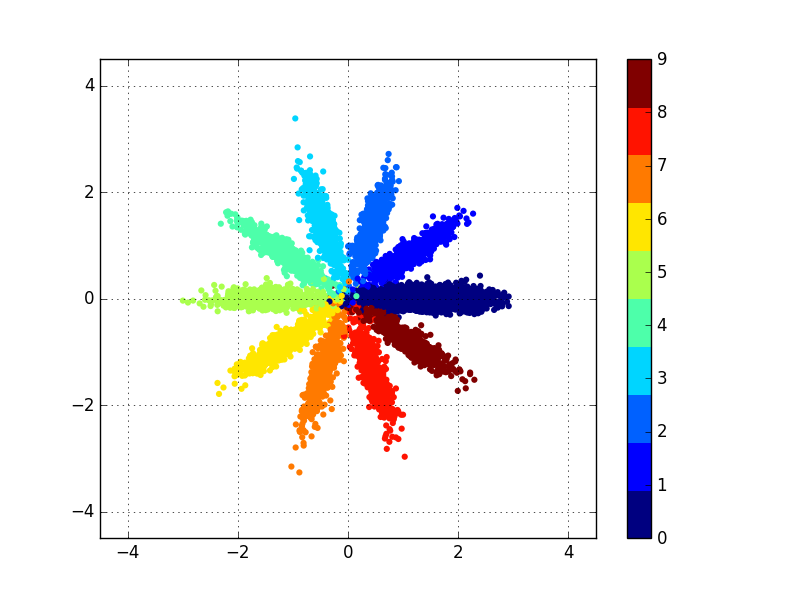
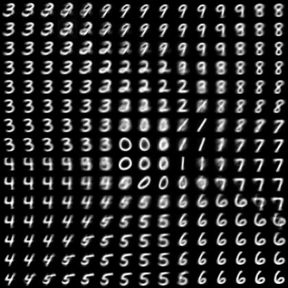

# Adversarial Auto-Encoder for MNIST
An implementation of adversarial auto-encoder (AAE) for MNIST descripbed in the paper:  
* [Adversarial Autoencoders](https://arxiv.org/abs/1511.05644) by Alireza Makhzani et al.

## Implementation Details
The paper suggest various ways of using AAE.
* Basic AAE
* Incorporatiing Label Information in the Adversarial Regularization
* Supervised AAE
* Semi-supervised AAE
* Unsupervised Clustering with AAE
* Dimensionality Reduction with AAE  

Only results on 'Incorporatiing Label Information in the Adversarial Regularization' are given here.

## Results

Leveraging label information to better regularize the hidden code in Figure 4 in the paper.

### Target Distributions
Three types of prior distrubtion are considered : a mixture of 10 2-D Gaussians, a swiss roll distribution, and a normal distribution.  
Results on a normal distrubtion is not suggested in the paper.

The following graphs can be obtained with command:
```
python test_prior_type.py --prior_type <type>
```
<table align='center'>
<tr align='center'>
<td> mixGaussian </td>
<td> swiss_roll </td>
<td> normal </td>
</tr>
<tr>
<td>
<td>
<td>
</tr>
</table>

### Prior distribution type : a mixture of 10 2-D Gaussians
The following results can be reproduced with command:  
```
python run_main.py --prior_type mixGaussian
```
<table align='center'>
<tr align='center'>
<td> Learned MNIST manifold</td>
<td> Distribution of labeled data</td>
</tr>
<tr>
<td>
<td>
</tr>
</table>

### Prior distribution type : a swiss roll distribution
The following results can be reproduced with command:  
```
python run_main.py --prior_type swiss_roll
```
<table align='center'>
<tr align='center'>
<td> Learned MNIST manifold</td>
<td> Distribution of labeled data</td>
</tr>
<tr>
<td>
<td>
</tr>
</table>

### Prior distribution type : a normal distribution (not suggested in the paper)
The following results can be reproduced with command:  
```
python run_main.py --prior_type normal
```
<table align='center'>
<tr align='center'>
<td> Learned MNIST manifold</td>
<td> Distribution of labeled data</td>
</tr>
<tr>
<td>
<td>
</tr>
</table>

## Usage
### Prerequisites
1. Tensorflow
2. Python packages : numpy, scipy, PIL(or Pillow), matplotlib

### Command
```
python run_main.py --prior_type <type>
```

### Arguments
*Required* :  
* `--prior_type`: The type of prior distrubition. *Choices*: mixGaussian, swiss_roll, normal. *Default*: `mixGaussian`

*Optional* :  
* `--results_path`: File path of output images. *Default*: `results`
* `--n_hidden`: Number of hidden units in MLP. *Default*: `1000`
* `--learn_rate`: Learning rate for Adam optimizer. *Default*: `1e-3`
* `--num_epochs`: The number of epochs to run. *Default*: `20`
* `--batch_size`: Batch size. *Default*: `128`
* `--PRR`: Boolean for plot-reproduce-result. *Default*: `True`
* `--PRR_n_img_x`: Number of images along x-axis. *Default*: `10`
* `--PRR_n_img_y`: Number of images along y-axis. *Default*: `10`
* `--PRR_resize_factor`: Resize factor for each displayed image. *Default*: `1.0`
* `--PMLR`: Boolean for plot-manifold-learning-result. *Default*: `True`
* `--PMLR_n_img_x`: Number of images along x-axis. *Default*: `15`
* `--PMLR_n_img_y`: Number of images along y-axis. *Default*: `15`
* `--PMLR_resize_factor`: Resize factor for each displayed image. *Default*: `1.0`
* `--PMLR_z_range`: Range for unifomly distributed latent vector. *Default*: `3.0`
* `--PMLR_n_samples`: Number of samples in order to get distribution of labeled data. *Default*: `10000`

## Acknowledgements
This implementation has been tested with Tensorflow 1.2.1 on Windows 10.
